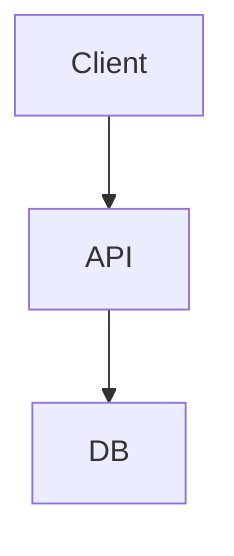

# Libs - набор PHP модулей 
* aibus.php - шина для вызовов LLM моделей
* aiengines/ - папка с обертками длЯ вызова LLM моделей через API
** openai.php - модуль для работы с любыми LLM, поддерживабющими API протокол OpenAI
** stub.php - модуль - заглушка для отладживания всей структуры орбаботки запросов, форматирования ответов

## пробуем диаграммы mermaid
Проблема: корректно отобразить блоки диаграм mermaid внутри markdown файлов

