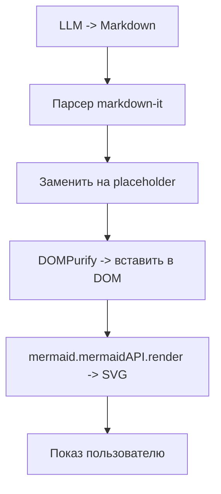
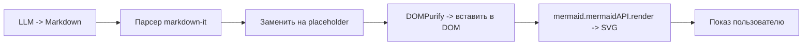

# Тестовая страница дял проверки отрисовки Markdown в чат-боте

Синтаксис Markdown: https://www.markdownguide.org/basic-syntax/

## Пример таблицы markdown
| колонка 2 | колонка 2| Колонка 3|
|---|---|---|
|Москва|2024|  233 000,22|
|Воронеж|2021|  555 000,40|

## пример вывода кода PHP
```php
$files = glob(__DIR__ . '/aiengines/*.php');
$arRet = [];
foreach($files as $enfile) {
    $namef = substr(basename($enfile), 0,-4);
    if(substr($namef,0,4)=='cfg.') continue;
    $arRet[] = [$namef, $namef];
}
return $arRet;
```

## Пробуем поддержку диаграмм и чартов Mermaid
Доки про mermaid: https://github.com/mermaid-js/mermaid/tree/develop/docs

## Блок-схема (сверху вниз - flowchart TB)


## Блок-схема (слева направо - flowchart LR)


_Ну вот как-то так!_