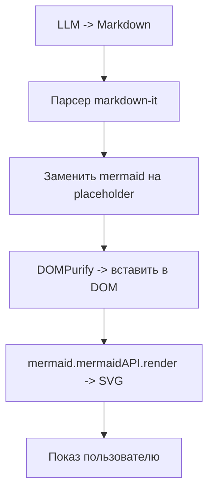
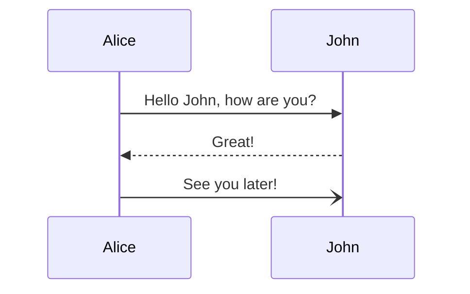
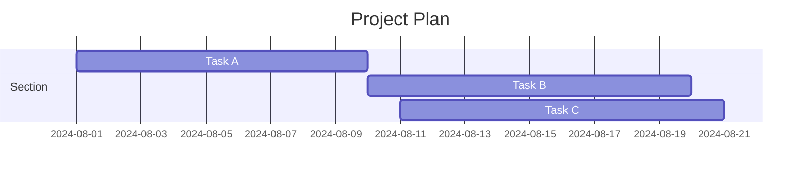

# Тест 2 - Тестируем mermaid схемы
Доки про mermaid: https://github.com/mermaid-js/mermaid/tree/develop/docs

```mermaid
flowchart TB
 A[LLM -> Markdown] --> B[Парсер markdown-it]
 B --> C[Заменить mermaid на placeholder]
 C --> D[DOMPurify -> вставить в DOM]
 D --> E[mermaid.mermaidAPI.render -> SVG]
 E --> F[Показ пользователю]
```

# Последовательность действий - *sequenceDiagram*

```mermaid
sequenceDiagram
    Alice->>John: Hello John, how are you?
    John-->>Alice: Great!
    Alice-)John: See you later!
```

# Диаграммы Ганнта - *gantt*

```mermaid
gantt
    title Project Plan
    dateFormat  YYYY-MM-DD
    section Section
    Task A           :a1, 2024-08-01, 2024-08-10
    Task B           :after a1  , 10d
    Task C           :2024-08-11  , 10d
```