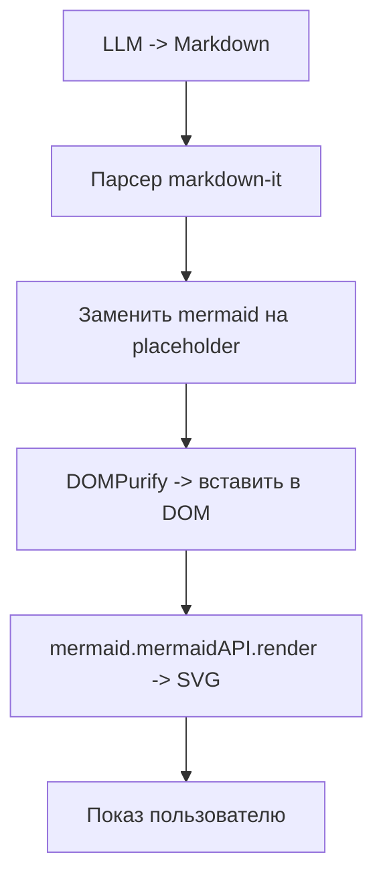

# Тест 2 - Короткая схема тестирую mermaid схемы
Доки про mermaid: https://github.com/mermaid-js/mermaid/tree/develop/docs



## Минимальный HTML
```html
<i>Тут кусок HTML кода</i>
<h2> Заголовок типа 2 </h2>
```
Ну вот как-то так!